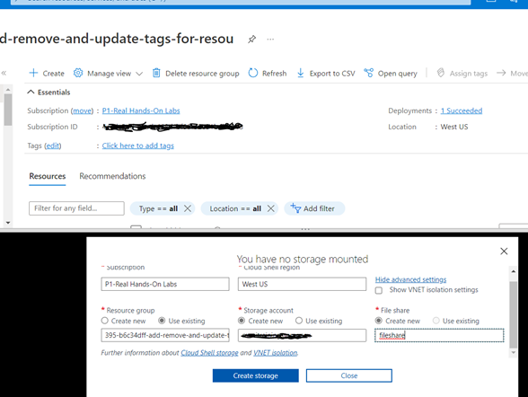
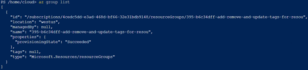
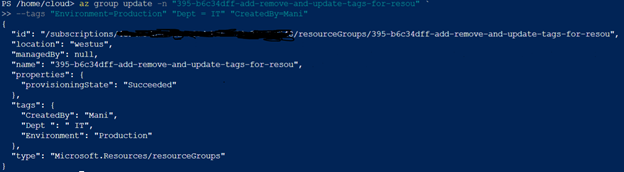
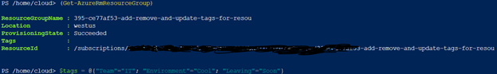
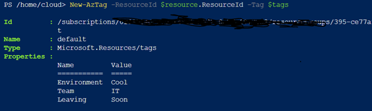
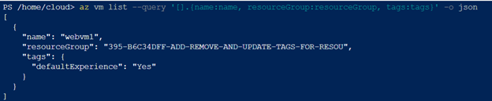
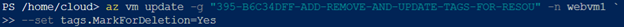
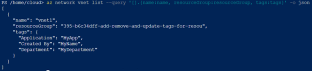

# Add, Remove and Update Tags for Resources in Azure

## Scenario
The finance department has reached out to you, requesting additional taxonomy information on a recent Azure bill, including who created the resources, which department budget should be used for the resources and if the resources are necessary for running business ciritcal systems. If there are any non-essential business systems, they ask that you signify that in some way.

## Learning Objectives

* Add Tags to the Resource Group
* Remove Tags for VM and Mark for Deletion
* Change Tags for the Virtual Network

## Lab Solution

For this lab, I will manily use Azure CLI. 

* First, I open PowerShell in Azure and create a storage to be able to use it

1.	Add Tags to the Resource Group.
   
   - Listing the resources groups
     

   - Adding the Tags
    

**Using PowerShell:**

  -  Retrieving the Resource info and setting the tags variable

 
 - Adding the tag to the resource group

2.	Remove Tags from VM and Mark for Deletion

 - Showing VMs tags

- Remove tags from VM

- Set Mark for Deletion tag

3.	Change the Tags for the Virtual Network

-	Listing Virtual networks:

- Adding Tags to the Virtual Network

