# Attach a Firewall to a Virtual Network in Azure

## Scenario 

The company needs to restrict outgoing traffic from their server using a firewall. They want me to block users from visiting anything besides https://www.microsoft.com 
and they don't want to allow port 53 outbound from the server. I will create a firewall and connect it to my virtual network as a solution.

## Objectives

* Create a Firewall
* Create a Route Table
* Configure Rule Collections for Firewall
* Test Connectivity

## Lab Solution

1.	Create a Firewall

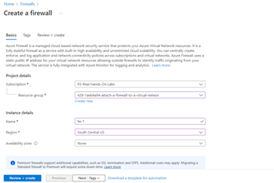
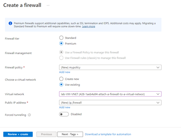

Once the firewall is created, I go to the resource and copy the IP

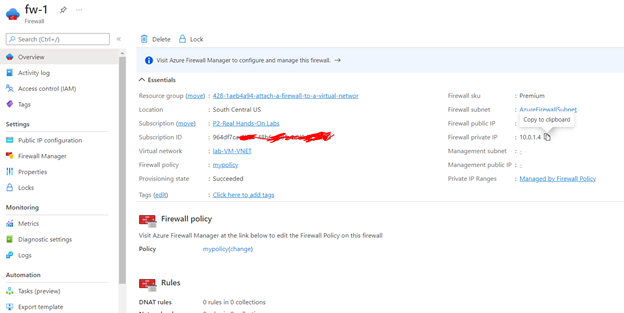

2.	Create Route Table

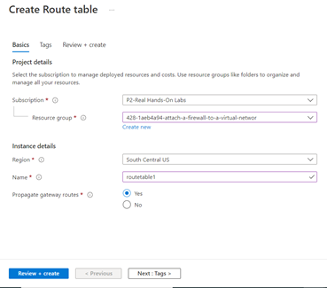

Once created, I go to the Route Table and add a route that routes all traffic (0.0.0.0/0) to the Firewall appliance (I use the IP of the Firewall).

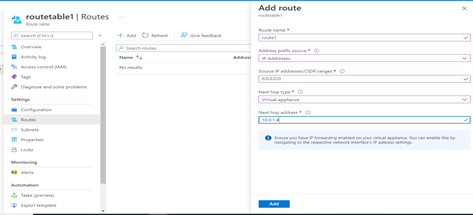

I go to Subnet, and associate my subnet

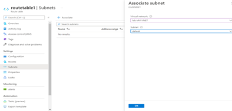

3.	Configure Rule Collections for Firewall

    3.1 Add a NAT rule that will route traffic from the firewall public IP to the private IP of the server over 3389 (RDP).

On the Firewall, I go Firewall Manager

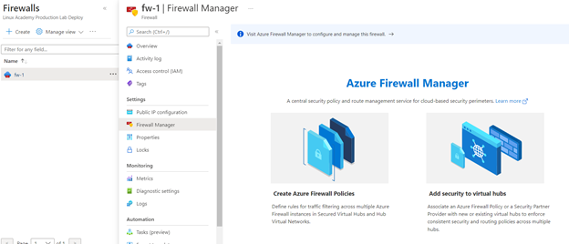

I go to my Policy attached to the Firewall, and add a DNAT rule collection using the public IP of the firewall and translated to the Private IP of the VM (server)

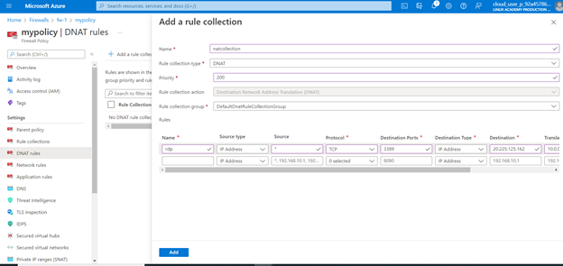
This rule will allow me to RDP to my firewall, and this will be translated to the Virtual machine so I am RDPing into the VM via the firewall

    3.2	Add a network rule to allow UDP port 53 outbound to Google public DNS servers (8.8.8.8 and 8.8.4.4).
 
 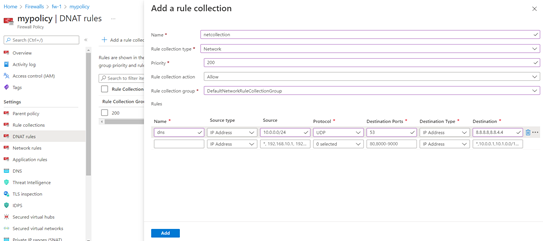
 
    3.3	Configure an application rule collection to allow www.microsoft.com from the default subnet CIDR over the http and https protocols under Target FQDNs
    
 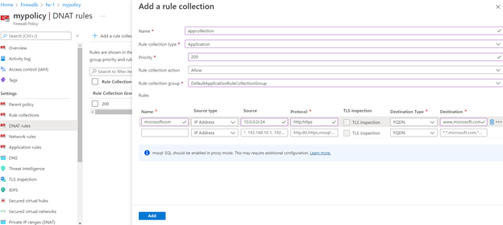   
 
    3.4 Add the public DNS servers to the network interface of the virtual machine.
I go to the VM > Networking

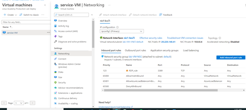   

Click on the Network Interface > DNS Servers, and add the Google DNS servers

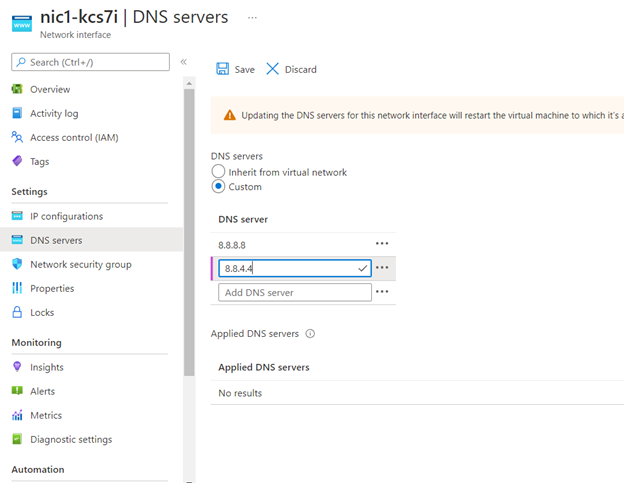  

4.	Test Connectivity
I take the public IP of the firewall, and use my Remote Desktop app to connect to the VM

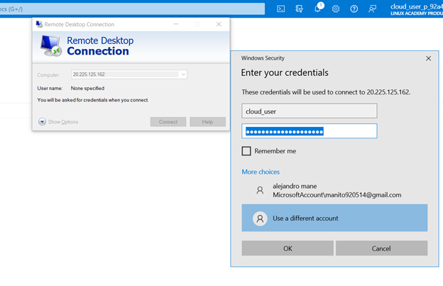 

Testing the app rule, we see it works as you can not access with Microsoft.com but need to use www.microsoft.com

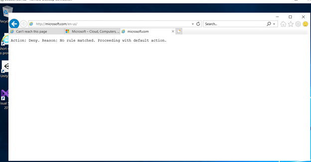 

Testing the DNS rule worked

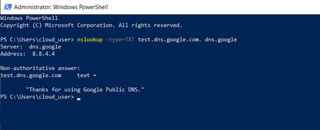 

