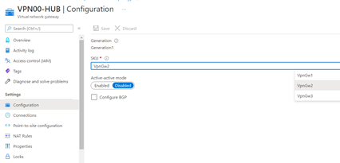
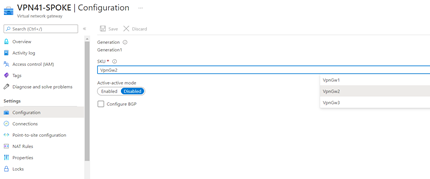
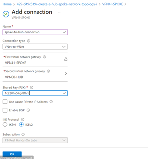
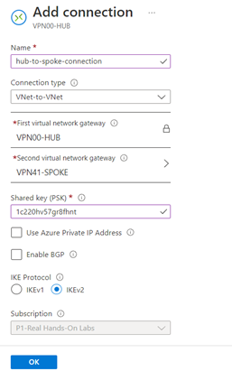
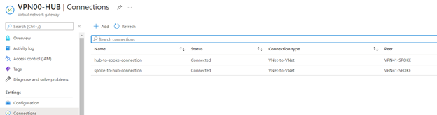

# Create a Hub-Spoke Network Topology in Azure

## Scenario

The company has a lot of redundant services (DNS, AD, intrusion detection, etc.) in their environment. To alleviate the management effort in maintaining those services,
my IT department is centralizing all redundant services into a hub. I will implement a hub-spoke topology, creating a hub VNet and a spoke VNet connection in Azure.

## Objectives

- Configure the Virtual Network Gateway
- Add a Gateway Connection

## Lab Results

1 . Configure the Virtual Network Gateway
In Azure, I go to the created gateways, and verify that the SKU is VpnGw2 for 1Gbps throughput 

2. Add a Gateway Connection
I first, go to VPN-41-SPOKE (VN gateway) and add a connection VNet-to-Vnet using a pre-shared key

I finally confirm they are both connected

