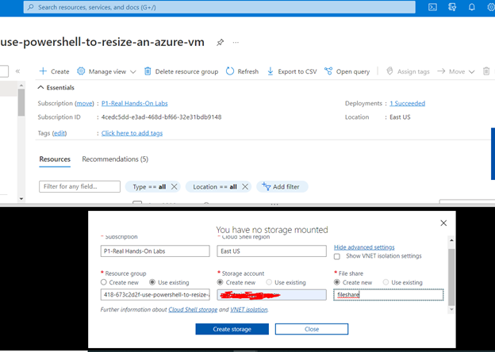

# Using PowerShell to Resize an Azure Virtual Machine in an Availability Set

## Scenario

My company's finance department explains that the cost of Azure virtual machines (VMs) is over budget. I must find an easy solution to decrease the cost of Azure VMs 
in my subscription. Using only PowerShell, I have to identify the VMs with low CPU utilization and change their size.

## Learning Objectives

* Start Cloud Shell
* Get the VM Size and CPU Metrics
* Resize VMs in Availability Set

## Lab Solution

1.	Start Cloud Shell
I go to the command icon on the top, select Power Shell > Advanced Settings, and create an unique storage account and file share as follow:

2.	Get the VM Size and CPU Metrics
Finding the size of the VMs

Getting the VM Subscription name

Getting the VM CPU metrics

3.	Resizing the VMs in the Availability Set
Checking which VMs are available to resize within the VM hardware cluster 

PowerShell command to resize the VM

Verifying the VM was updated

