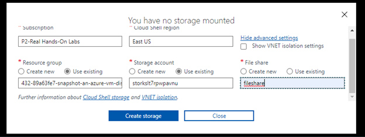
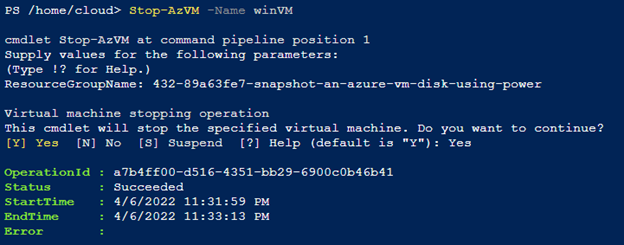
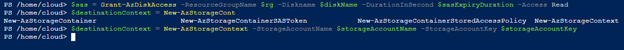
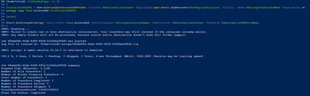
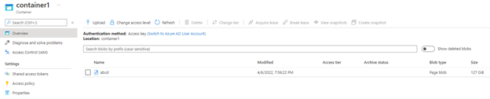

# Snapshot an Azure VM Disk Using PowerShell

## Scenario

My company has a legal requirement to keep all backups for a period of time to ensure data can be restored if needed. My manager has asked me to take a snapshot of a disk
in Azure, and make sure that I can access it. I will use PowerShell to take a snapshot of the VM disk and send it to a storage account.

## Objectives

* Stop the Virtual Machine
* Take a Snapshot of the VM
* Copy the Snapshot to Container

## Solution

1.	Stop the Virtual Machine
-	Creating a storage for PowerShell

-	Command to stop and deallocate VM

-	Creating variables

2.	Take a Snapshot of the VM
Once the VM has stopped, I create other variables, $sas to grant access to the disk, and $destinationContext to create an Azure context

3.	Copy the Snapshot to Container

- Checking the created snapshot

