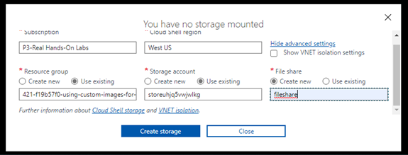
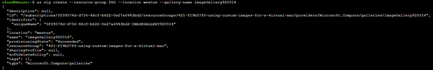
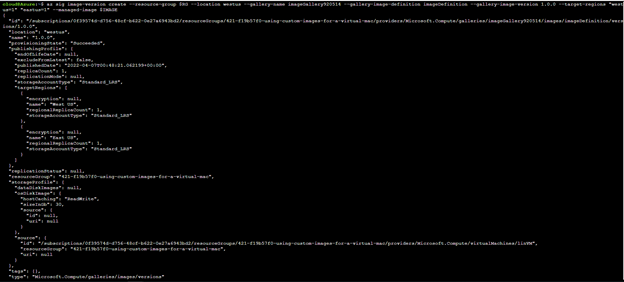
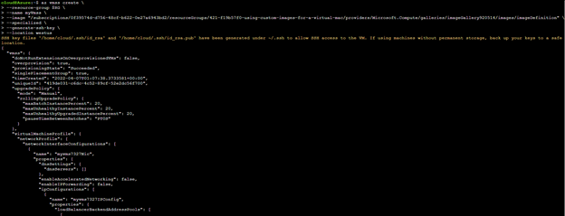
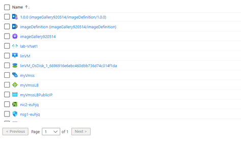
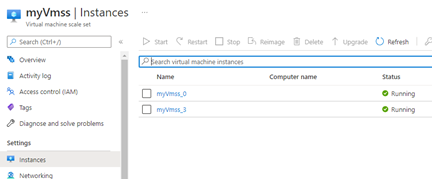

# Using Custom Images for a Virtual Machine Scale Set in Azure

## Scenario

My company has a custom Linux VM that they want to redeploy to a virtual machine scale set. I must find an efficient way of redeploying this VM without having to manually
install all custom packages and settings.

## Objectives

- Start Cloud Shell
- Set Resource Variables in Cloud Shell
- Create an Image from the VM
- Create a Virtual Machine Scale Set from an Image

## Solution

1.	Start Cloud Shell
Opening Cloud Shell in Bash

2.	Set Resource Variables in Cloud Shell
Set RG with the resource name and IMAGE with the Resource ID of the VM

3.	Create an Image from the VM
-	Creating an image gallery

-	Creating an image definition

-	Creating an image version

4.	Create a Virtual Machine Scale Set from an Image
I create the virtual machine scale set using the ImageID from the Image Definition I created before

-	Checking the results

