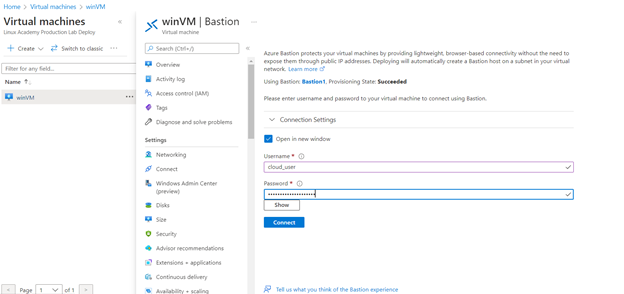

# Access Windows VMs over SSL withouth Public IPs using Azure Bastion

## Scenario

At my company, they've blocked port 3389 outgoing on the firewall and established a mandate that all Windows VMs not be accessible from the internet. In order to log in
to Windows VMs, I need to come up with a solution.

## Objectives

- Create an Azure Bastion Subnet
- Create an Azure Bastion Service
- Connect to the Windows VM via Bastion

## Lab Solution

1.	Create an Azure Bastion Subnet

2.	Create an Azure Bastion Service

3.	Connects to the Windows VM via Bastion
I go the VM, and connect via Bastion using the VM credentials.

