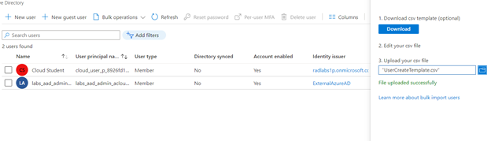
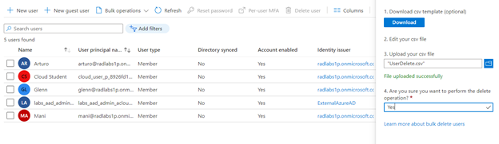
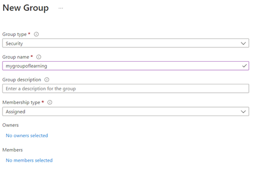
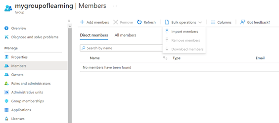
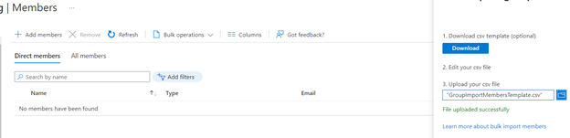

# Perform Bulk Azure AD Operations

Azure Active Directory (AD) is often a critical component in many cloud-based Azure solutions. With Azure AD you have a centralized identity and access management platform, which helps for much more than simply storing user details and credentials. In this hands-on lab, I walk through bulk operations that can be performed within the Azure Portal, to help streamline the management of user accounts and security groups.

## Learning Objectives

- Bulk Create Users
- Bulk Delete Users
- Bulk Add Group Members

## Lab Solution

1.	Bulk Create Users
	
-	Go to Users, Bulk Operations Dropdown, and Bulk Create.
-	Download the latest CSV template. Open and add the users filling the required fields.
-	Upload the CSV file with the users.

2.	Bulk Delete Users

-	Go to Users, Bulk Operations Dropdown, and Bulk Delete.
-	Download the latest template, open it and add the data of the user(s) to delete as required.
-	Upload the csv file to Bulk Delete

3.	Bulk Add Group Members

-	Go to Azure Active Directory, Groups, New Group and fill the data

-	Once I created the group, I click on it, Go to members Bulk Operations, and import them.

-	Download the csv template, fill the data as requested (in this case, user AD or username), and upload it back.

