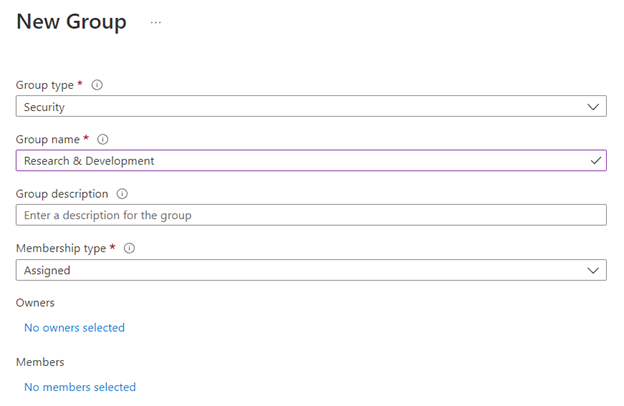
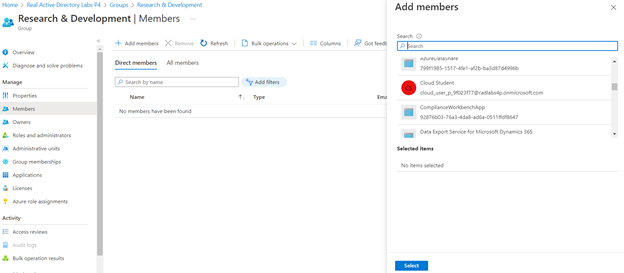

# Create a Group and Add a Member in Azure AD

## Scenario

The company is expanding. They have added a new Research and Development (R&D) department to invest in future capabilities, allowing them to make more 
strategic decisions. They have asked me to create the Azure Active Directory (AAD) group and add myself to it. I will need to log in to the Azure portal, navigate
to the Azure Active Directory (AAD) service, and perform the necessary steps to create the group and add myself as a member of the group.

## Learning Objectives

- Create a New Azure Active Directory Group
- Add Your Azure Active Directory User as a Member of the Group

## Lab Process

1-	Create a New Azure AD Group

-	Go to Azure Active Directory, Groups, Add a new group

2-	Add my Azure AD User as a Member of the Group

-	From the group list, go t the recently created group. 

-	Click Add Member, search for my user, and add it.

