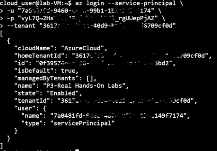
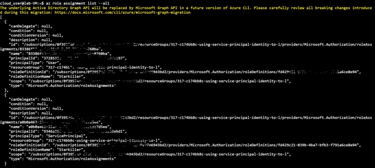

# Using Service Principal Identity to List AD Roles

## Scenario

In this hands-on lab, I am tasked with gathering the role definitions and role assignments for my organization. I do not have access to the portal, so I must collect
this information via SSH connection, by using a Linux VM and a service principal. Once access to the Azure subscription has been gained, I use the Azure CLI to collect 
the required information, and output to a file so I can email it to your manager.

## Learning Objectives

- Log in to Azure using the Service Principal
- List the Role Definitions and Role Assignments

## Lab Process

1.	Log in to Azure using the Service Principal
-	SSh into the Linux VM
-	Login into Azure using the Service Principal

2.	List the Role Definitions and Role Assignments
-	List the role definitions using “az role definition list” command
-	Output the file to a list named roleinfo.json: “az role definition list > roleinfo.json”
-	List the role assignments

-	Appending the list to the roleinfo.json file using: "az role assignment list --all >> roleinfo.json"
-	Verify the list on roleinfo.json:
      "Vi roleinfo.json"
