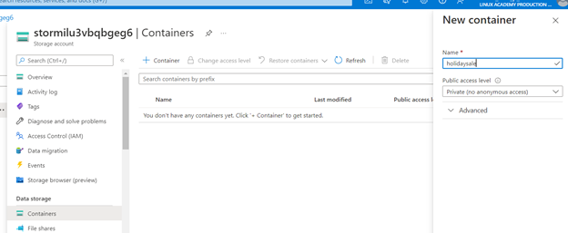
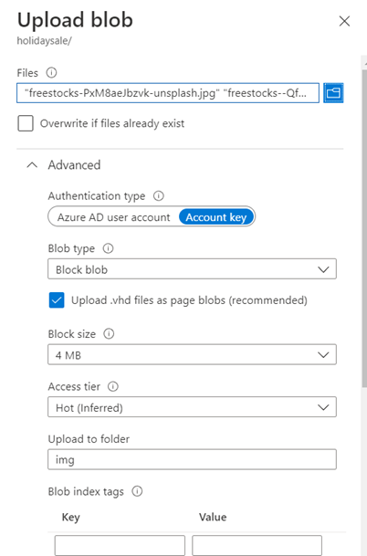
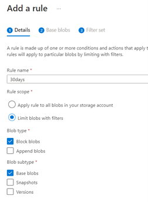
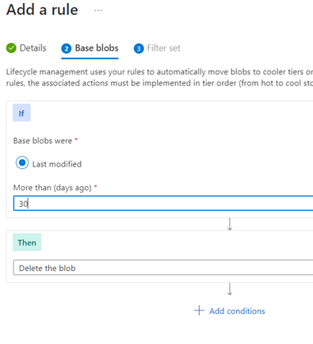

# Expire Data Based on Age inn Azure Blob Storage

## Scenario

In the scenario for this hands-on lab, I am taking the role of the web admin for an online shopping site. The holidays are coming, so I anticipate holiday themed items
becoming popular in the store. My plan to showcase these items on the homepage, in which a web app retrieves the photos for these items from an Azure Storage account. 
After the holiday season, I don't want to keep these images, and the storage costs are too significant. I must find a way to automatically delete these photos after 30
days.

## Learning Objectives

- Upload the Photos to Blob Storage
- Add a Policy to the `img` Folder

## Lab Solution

1 – Upload the photos to Blob Storage

-	Go to Storage Accounts, click on the storage > Data Storage > Containers > Add new container with Container access level > Add the photos

2. Add a Policy to the img Folder

- Go to Data Management > Lifecycle Management > Add a new rule

