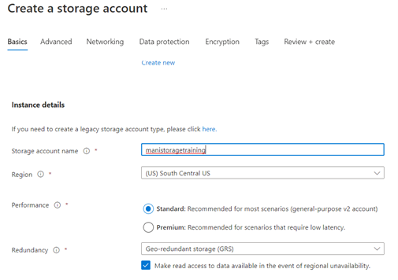
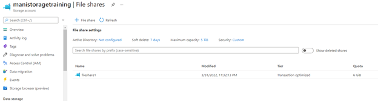
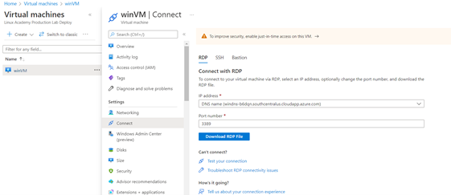
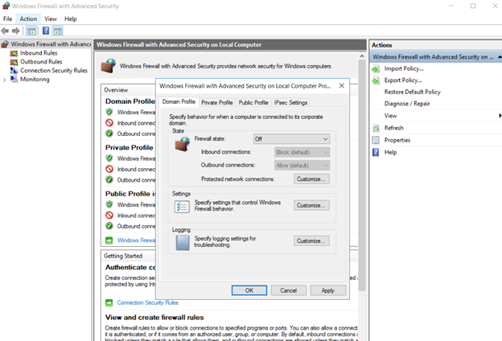
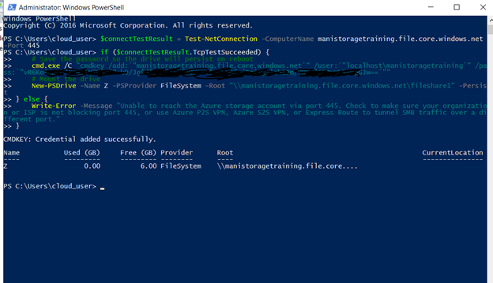

# Create and Restore File Share Snapshots

## Scenario

The company needs to ensure that backups are in place for all file shares. File versioning is also important, because employees are often modifying files within the file
share. To test functionality, I am tasked with taking a shapshot of a file share and restoring it to my Windows machine.

## Leanring Objectives

- Create a Storage Account and File Share
- Connect File Share to Windows VM
- Take a Snapshot and Restore Data

## Lab Process

1.	Create a Storage Account and File Share
-	Create a new storage account

-	Create a fileshare with a 6GB quota

2.	Connect File Share to Windows VM
-	In Virtual Machines, we go to our created VM, and connect via RDP

-	Once connected to the Windows, I go to Windows Firewall > Properties > Tuen the Firewall OFF.

-	I open Windows PowerShell as administrator. On Azure portal, go to my storage > fileshare, click on Connect and copy the PowerShell script.

3.	Take a Snapshot and Restore the Data

-	In the newly created Z drive, I create a new .txt and make sure it is create in the Azure Portal as well.
-	I take a snapshot.
-	In the Windows machine, I make a change to the file and save the changes.
-	To restore the previous version, I right click the Z Drive> Restore previous versions
-	I select the snapshot from the list > open; and drag and drop the file to the Windows VM Desktop
