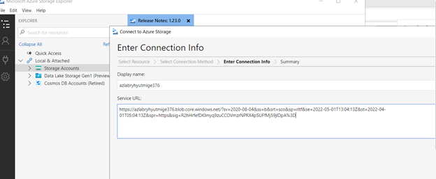

# Limit Access to Azure Storage Account Using SAS URI

## Scenario

My company has hired a contractor, and they need access to a storage account in order to perform their duties. They will need access to the storage account for 30 days,
in which they should only be able to read and list the data. It's important that they don't have the ability to add, create, or delete data in the storage account.

## Learning Objectives

- Create a Storage Container
- Copy Data into the Storage Container
- Generate a SAS URI for the Storage Account

## Lab Solution

1.	Create a Storage Container

-	Go to Azure Storage > Create Container

2.	Copy Data into Storage Container

3.	Generate a SAS URI for the Storage Account
-	Go to the storage account > Shared Access Signature, and configure as follow

-	Generate the SAS and Copy the Blob Service SAS URI
-	Open a Windows VM and connect using RDP
-	Open a browser and go to https://azure.microsoft.com/en-us/features/storage-explorer/ ,download and install for all users.
-	Open Microsoft Azure Storage Explorer > Click to connect to a Storage account or service using Shared Access signature (SAS). Paste the blob service SAS URL

-	Open the Contractor container and attempt to delete one of the files. This action should fail.

-	Attempt to add a new file within the container. This action should also fail.

