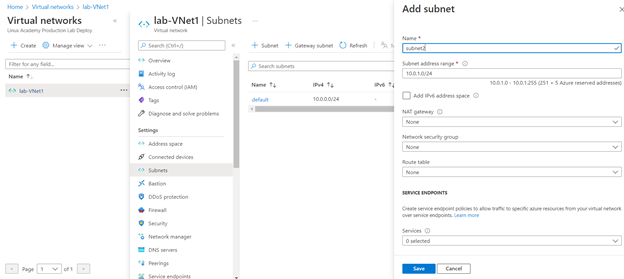
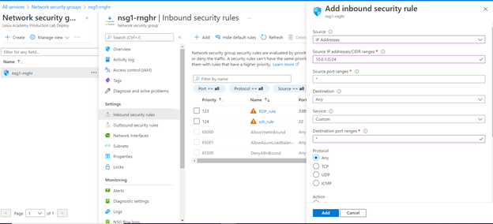
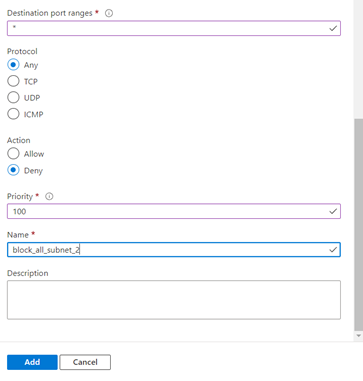
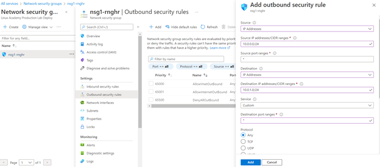
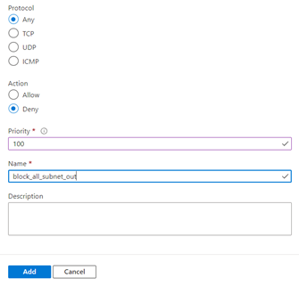
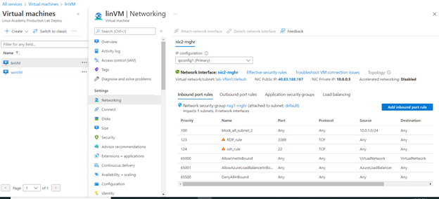
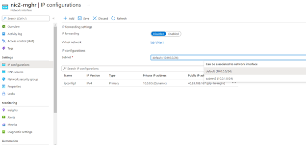
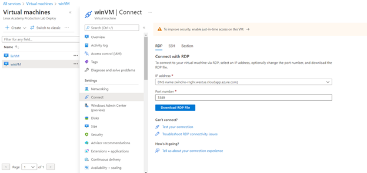
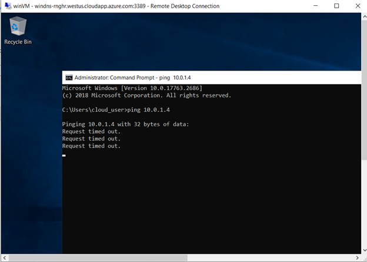

# Creating Multiple Subnets in Azure

## Scenario

My company wants to block communication between two VMs. They currently reside on the same network and on the same subnet. I have to ensure they are separated into
different subnets and communication is blocked using a network security group.

## Objectives

- Create a New Subnet
- Create New Network Security Group Rules
- Move the VM to the new subnet

## Lab Solution

1.	Create a New Subnet. Go to Virtual Network, select the network and add a subnet.

2.	Create New Network Security Group Rules
We go to Network Security groups, click on the created one > Inbound security rules, add one as follow:

Do something similar with Outbound Rules:

3.	Moving the VM to the new subnet:
First, we go to our VM > Networking (under settings)

I go to my network interface (nic-rnghr) > IP Configurations > Subnet > selec the new subnet (subnet2)

4.	Test the connection:
I go to the other VM (winVM)> Connect  RDP (Download the RDP file)

I opened the RDP file, opened the command line and tried to connect to the subnet IP, getting a timed out request:

