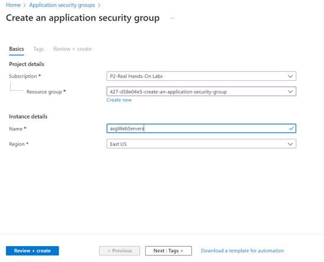
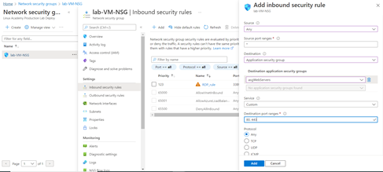
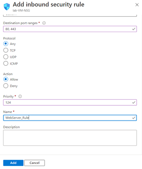
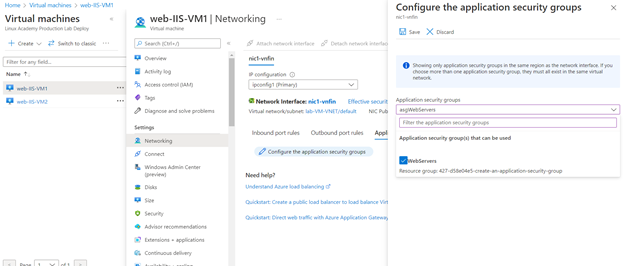
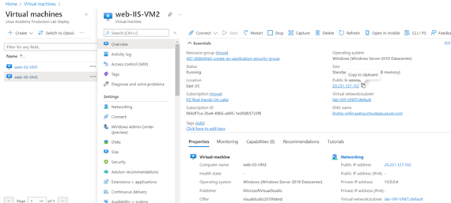
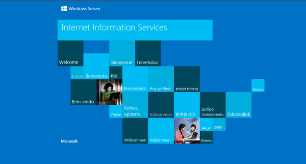

# Create an Application Security Group for Two Web Servers in Azure

## Scenario 

My company has prepared two web servers and they intend to start serving traffic to them soon. Both servers have IIS installed, but they don't have port 80 (HTTP) or 443
(HTTPS) open for internet traffic. I have been tasked with creating an application security group, associating it with a network security group, and ensuring that the
servers are accessible from the internet.

## Learning Objectives

* Create a New Application Security Group
* Create a New Network Security Rule
* Test Connectivity to the Web Servers

## Lab Solution

1.	Create a new Application Security Group
I go to VM in resources to verify the location of it (East US). Then I go to All services and search for Application Security Group, and create one in the same location.

2.	Create a Network Security Group
I search for nsg, select the already created Network Security Group > Inbound Rules and create one, selecting the Application Security Group as destination

I go to both VMs to attach the Application Security Rules. I go to Networking > Application Security Group and select the one I created

3.	Test Connectivity to the Web Servers
I go to Overview and copy the public IP

And confirm I see the IIS

